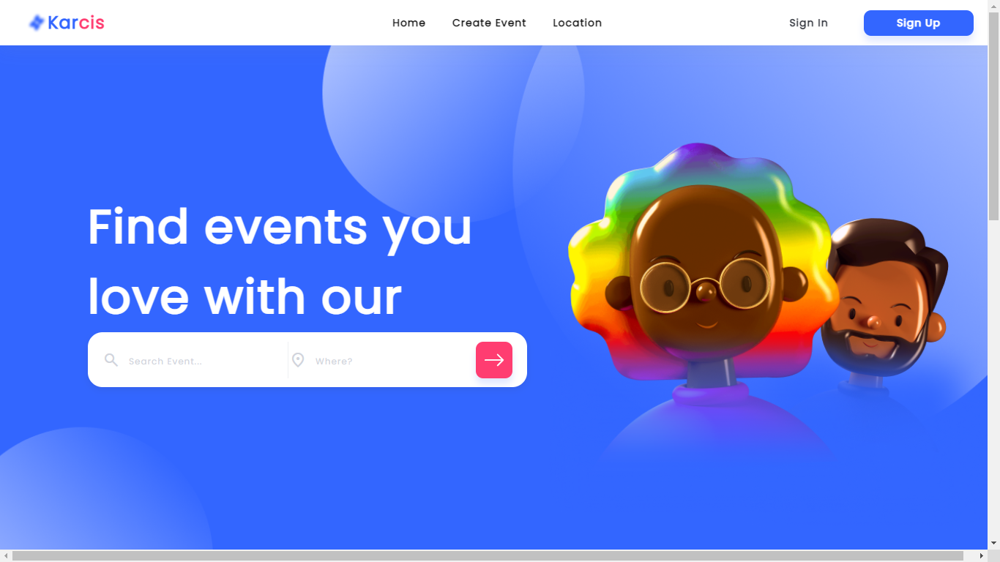

<h1 align='center'>Karcis Project</h1>
  <p align="center">
    <a href="https://karcis-project-website.netlify.app">View Demo</a>
    ·
    <a href="https://github.com/billhikmah/karcis-project-responsive-website/issues">Report Bug</a>
    ·
    <a href="https://github.com/billhikmah/karcis-project-responsive-website/pulls">Request Feature</a>
  </p>



## About The Project

Karcis Project is a website for purchasing event tickets. This website is built using HTML, CSS, and Bootstrap. This responsive website can be accessed through various devices such as mobile phones, tablets, iPads, and PCs.

## Built With

[](https://getbootstrap.com/)
[](https://getbootstrap.com/)
[](https://getbootstrap.com/)

## Acknowledgements

- [Bootstrap](https://getbootstrap.com/)

<h2>How to Install</h2>

1. Clone the repository
   ```
   https://github.com/billhikmah/CoffeeShop-Frontend-HTML-CSS
   ```
2. Open the file using [VSCode](https://code.visualstudio.com/download)

<h2>Demo</h2>

1. [Home](https://karcis-project-website.netlify.app)
1. [Sign In](https://karcis-project-website.netlify.app/signin)
1. [Sign Up](https://karcis-project-website.netlify.app/signup)
1. [Detail](https://karcis-project-website.netlify.app/detail)
1. [Booking](https://karcis-project-website.netlify.app/booking)
1. [Payment](https://karcis-project-website.netlify.app/payment)

<h2>Related Documentation</h2>

- Server (Backend)<br>
  Server documentation can be accessed via [Postman](https://documenter.getpostman.com/view/20723287/UyrEguSx). The backend has been deployed to [Vercel](https://www.vercel.com) and the assets have been uploaded to [Cloudinary](https://www.cloudinary.app/).

## License

© [Bill Hikmah 2022](https://github.com/billhikmah/)
